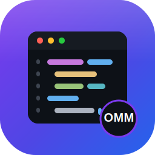

<div align="center">



# NotepadOMM

A Notepad++‑style text and code editor for Linux, built with Python, PyQt6 and
**QScintilla** — the same editing engine used by Notepad++.


🇧🇷 [Versão em português](README.pt-BR.md)

</div>

---

## Features

- **Tabbed interface** — open many files at once; tabs are closable and can be
  reordered by dragging.
- **Syntax highlighting** for Bash/Shell, C/C++, CSS, HTML, Java, JavaScript,
  JSON, Markdown, Perl, Python, Ruby, SQL, XML and YAML (auto‑detected by file
  extension).
- **Manual language selection** from the *Language* menu — force highlighting
  even for files without a recognized extension; the status bar shows the
  active language.
- **Automatic session save** (*Auto* menu, on by default): the state of every
  tab — including untitled and unsaved ones — is stored in the background at a
  configurable interval (15 s, 30 s, 1 min, 5 min). Close and reopen the app and
  it comes back with all tabs exactly as they were, with no "save?" prompt. It
  **never writes to your files** — that only happens when you explicitly save
  (`Ctrl+S`).
- **Remembered settings** across runs: theme, auto‑save and interval are stored
  in `~/.config/notepadomm/`.
- **Notepad++‑style macros** (*Macro* menu + toolbar with icons): record/stop,
  run once, run N times **or until the end of the file**, stop a running macro,
  and save/load macros to disk.
- **Tools** (*Tools* menu): **pretty‑print and validation for JSON and XML** —
  format (`Ctrl+Alt+L` formats according to the tab's active language) and
  validate, with the caret jumping straight to the line/column of any error.
- **Find & Replace** with regular expressions, whole‑word and case‑sensitive
  options.
- **Light and dark themes** (`Ctrl+Shift+T`).
- Line numbers, code folding, indentation guides, auto‑indent, brace matching,
  current‑line highlight, word wrap and zoom.
- Unsaved‑changes prompt on close, and opening files from the command line:
  `notepadomm file.py`.

## Screenshot

<div align="center">
  
  <p><i>Replace this with a real screenshot of the running app.</i></p>
</div>

## Requirements

- Linux (developed and tested on Ubuntu 24.04)
- Python 3.10+
- [PyQt6](https://pypi.org/project/PyQt6/) and
  [PyQt6‑QScintilla](https://pypi.org/project/PyQt6-QScintilla/)

## Project structure

```
notepadomm/
├── main.py             # entry point (sets the app name and window icon)
├── editor.py           # editor widget (QScintilla) + themes + lexers
├── main_window.py      # window, tabs, menus, file I/O, find/replace,
│                       #   auto-save, macros and JSON/XML tools
├── requirements.txt
├── build.sh            # builds a standalone binary with PyInstaller
├── notepadomm.desktop  # application‑menu launcher
└── assets/
    ├── notepadomm.svg  # app icon (scalable)
    └── notepadomm.png  # app icon (256 px raster)
```

## Run from source

On Ubuntu, QScintilla needs the system Qt libraries:

```bash
sudo apt update
sudo apt install -y python3-venv python3-pip libxcb-cursor0

git clone https://github.com/<your-user>/notepadomm.git
cd notepadomm

python3 -m venv .venv
source .venv/bin/activate
pip install -r requirements.txt

python main.py            # launch the editor
python main.py file.py    # launch and open a file
```

> If you hit an `xcb` platform‑plugin error, installing `libxcb-cursor0`
> resolves it in most cases.

## Build a standalone binary

`build.sh` uses PyInstaller inside a virtual environment (so it never touches
the system Python — no `externally-managed-environment` error). **Do not run it
with `sudo`.**

```bash
chmod +x build.sh
./build.sh
./dist/notepadomm/notepadomm
```

For a single‑file executable (slower to start), change the mode in `build.sh`
to `--onefile`.

## Packaging

### AppImage (portable, runs on any distro)

```bash
wget https://github.com/AppImage/AppImageKit/releases/download/continuous/appimagetool-x86_64.AppImage
chmod +x appimagetool-x86_64.AppImage
sudo mv appimagetool-x86_64.AppImage /usr/local/bin/appimagetool
```

Then uncomment the AppImage block at the bottom of `build.sh` and run
`./build.sh`. The result is `NotepadOMM-x86_64.AppImage` — just `chmod +x` and
distribute it.

### Debian package (`.deb`)

Starting from the binary produced by PyInstaller in `dist/notepadomm/`:

```bash
mkdir -p notepadomm-deb/DEBIAN
mkdir -p notepadomm-deb/usr/lib/notepadomm
mkdir -p notepadomm-deb/usr/bin
mkdir -p notepadomm-deb/usr/share/applications
mkdir -p notepadomm-deb/usr/share/icons/hicolor/scalable/apps

cp -r dist/notepadomm/* notepadomm-deb/usr/lib/notepadomm/
ln -sf /usr/lib/notepadomm/notepadomm notepadomm-deb/usr/bin/notepadomm
cp notepadomm.desktop notepadomm-deb/usr/share/applications/
cp assets/notepadomm.svg notepadomm-deb/usr/share/icons/hicolor/scalable/apps/

cat > notepadomm-deb/DEBIAN/control << 'CTRL'
Package: notepadomm
Version: 1.0.0
Section: editors
Priority: optional
Architecture: amd64
Maintainer: Omar Moussa <your-email@example.com>
Description: Notepad++-style text and code editor
CTRL

dpkg-deb --build notepadomm-deb notepadomm_1.0.0_amd64.deb
sudo apt install ./notepadomm_1.0.0_amd64.deb
```

> The PyInstaller‑based `.deb` bundles Python and Qt, so it is large
> (~200 MB). A slimmer alternative is a `.deb` that depends on the system
> `python3-pyqt6` and `python3-pyqt6.qsci` packages instead of bundling them.

## Keyboard shortcuts

| Action | Shortcut |
| --- | --- |
| New file | `Ctrl+N` |
| Open | `Ctrl+O` |
| Save / Save As | `Ctrl+S` / `Ctrl+Shift+S` |
| Close tab | `Ctrl+W` |
| Quit | `Ctrl+Q` |
| Find & Replace | `Ctrl+F` |
| Zoom in / out | `Ctrl++` / `Ctrl+-` |
| Toggle word wrap | `Ctrl+Shift+W` |
| Toggle theme | `Ctrl+Shift+T` |
| Record / stop recording macro | `Ctrl+Shift+R` |
| Play macro (once) | `Ctrl+Shift+P` |
| Stop macro playback | `Esc` |
| Format document (JSON/XML) | `Ctrl+Alt+L` |

## Notes on the tools

- JSON is formatted with a 2‑space indent using Python's standard library.
- XML is formatted and blank lines produced by `minidom` are stripped.
- Validation checks that the document is **well‑formed** (valid syntax). It does
  not validate against a schema (XSD / JSON Schema) — that could be added with
  `lxml` if needed.
- The *until end of file* macro mode is meant for macros that **advance** the
  caret through the document (e.g. move down a line, then edit); it stops on its
  own when the caret reaches the end.

## Contributing

Issues and pull requests are welcome. If you add a language, wire its lexer into
`LEXER_MAP` and `LANGUAGES` in `editor.py`.

## License

Released under the MIT License. Add a `LICENSE` file to the repository if you
have not already.
